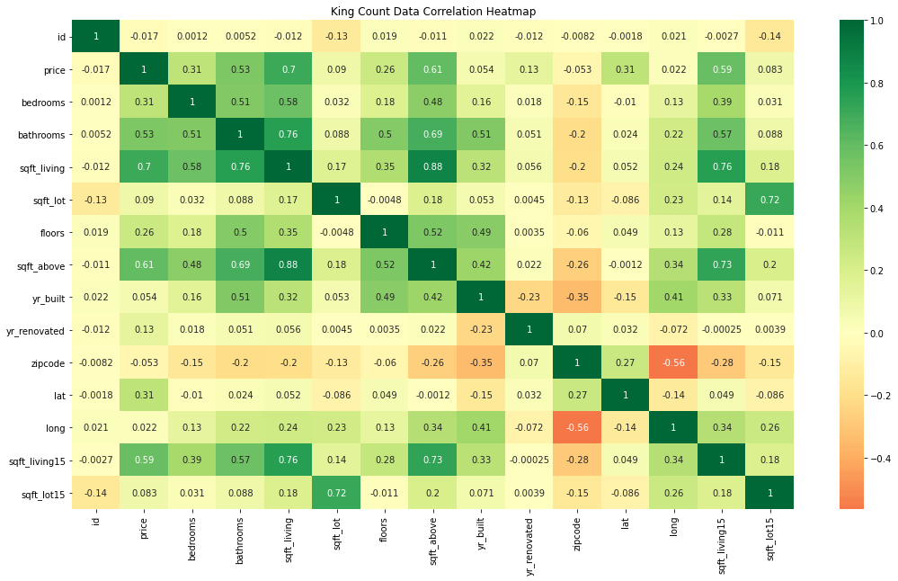
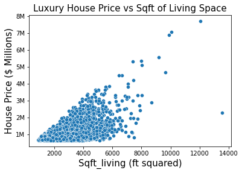
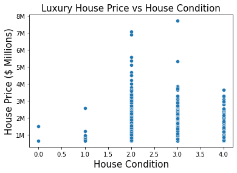
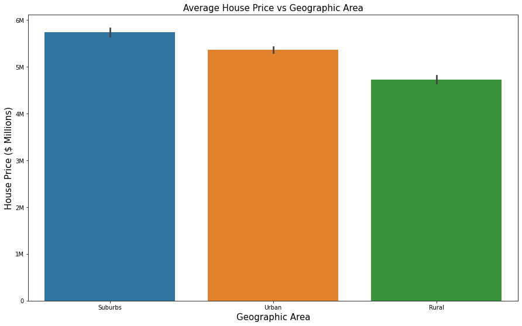

# **Business Recommendations for Elites Sports Realty Group:**
Presented by Ben Ywani and Henry Shin in associaion with Henrito's Analytics Group.

**Project Overview**
This project involves creating several inferential linear regression models to predict real estate sale prices in King County, WA. Inferential analysis of house sale predictors shows that some variables such as sqft_living and condition have a higher correlation to house sale price than other house sale predictors. The Elite Sports Realty Group can use this analysis to predict future house sale price to help prepare purchasing homes for their wealthy, professional athlete clientel. 

**Business Problem**
The Elite Sports Realty Group just partnered with both the Seattle Seahawks and Seattle FC to provide real estate services to its wealthy professional athlete clientel. The ESRG has reached out to Henrito Analytics to do an analysis about which housing variables can best predict future house prices. 

**Data**
2014-2015 King County, Washington House Sales dataset with over 20k transactions describing 19 unique features about the location, the building, the property, and the transaction. The detailed description of the column names can be found in the 'column_names.md' file in this repository as well as the dataset itself "kc_house_data.csv". 

**Methods**
There were a couple important data prepation steps used for this project. Because the business problem requires upscale, lavish houses, houses the cost $650K and above were used. Then, these luxury homes were further binned into three unique geographic areas (downtown Seattle, the suburbs, and rural) to give reccomendations based on the players lifestyle preferences. Furthermore, the luxury home data needed to be cleaned by manipulating grade values and views to numeric values. 

A helpful starting point to see which variables could be the best house sale predictors, a correlation heatmap with numerical variables was created and anaylzed. The following numerica variables: bedrooms, bathrooms, sqft_living, floors, sqft_above displayed the strongest correlations to sale price. However, multicollinearity was considered when choosing which of these variables were to be used in modeling.  

Initial Exploratory Data Analysis methods included visualizing the relationships between predictors and the luxury home sale price. 

Luxury House Price vs Sqft_Living

Luxury House Price vs House Condition

Lastly, the average luxury home price and georaphic area was also visualized and analyzed for athletes with different lifestyle preferences. 

**Results**
The baseline model created just used the luxury house sale prices and will be used to compare to the linear regresion models used. Three models were made in total. The first model used the following predictors: bedrooms, bathrooms, condition, and sqft_living. The second model used the following predictors: sqft_living, floors, views, grade, is_it_rennovated. Finally, the last model used the following predictors: Sqft_Living, Condition, and Views. The important metrics calcualated were the R Squared and RMSE and the R Squared metric improved each time from 0.48, 0.54, 0.63, while the RMSE was relatively steady from $226K, $223.5K, $222K. The R Squared is a measure of fit and it means the proportion of the variance in the luxury house sale price explained by the predictor variables. The RMSE (Root Mean Square Deviation) is another model accuracy indicator and it means how far the spread of residuals are to the line of best fit. 

**Conclusions**
The Elite Sports Realty Group should look for luxury houses with bigger living spaces and better conditions within the Seattle downtown area or anywhere in the suburbs of Bellevue if their client prefer the quiet life. 

**Future Investigations**
Analysis on the various luxury home features and amenities such as a wine cellar or home theatre, the garage lot size and location, and the quality of school district for the athlete's children are all potential house sale predictors with more available data. 

**For More Information**
Please review our full analysis in our [Jupyter Notebook](https://github.com/Bywani/king_county_real_estate/blob/main/kings_county_project.ipynb) or our [presentation](https://github.com/Bywani/king_county_real_estate/blob/main/King-County-Real-Estate-Project.pdf). 
For any additional questions, please contact Benito Ywani (Bjim006@gmail.com) and Henry Shin (hjshin386@yahoo.com)

**Repository Structure**
├── data
├── images
├── King-County_Real-Estate-Project.pdf 
├── README.md
└── kings_county_project.ipynb